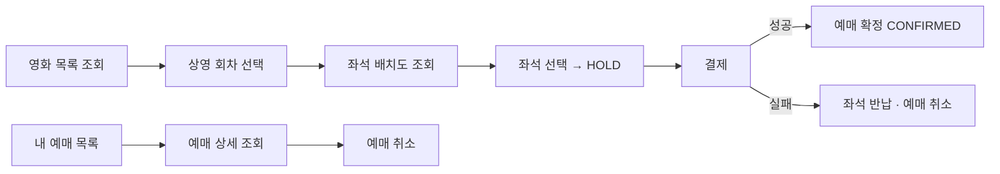
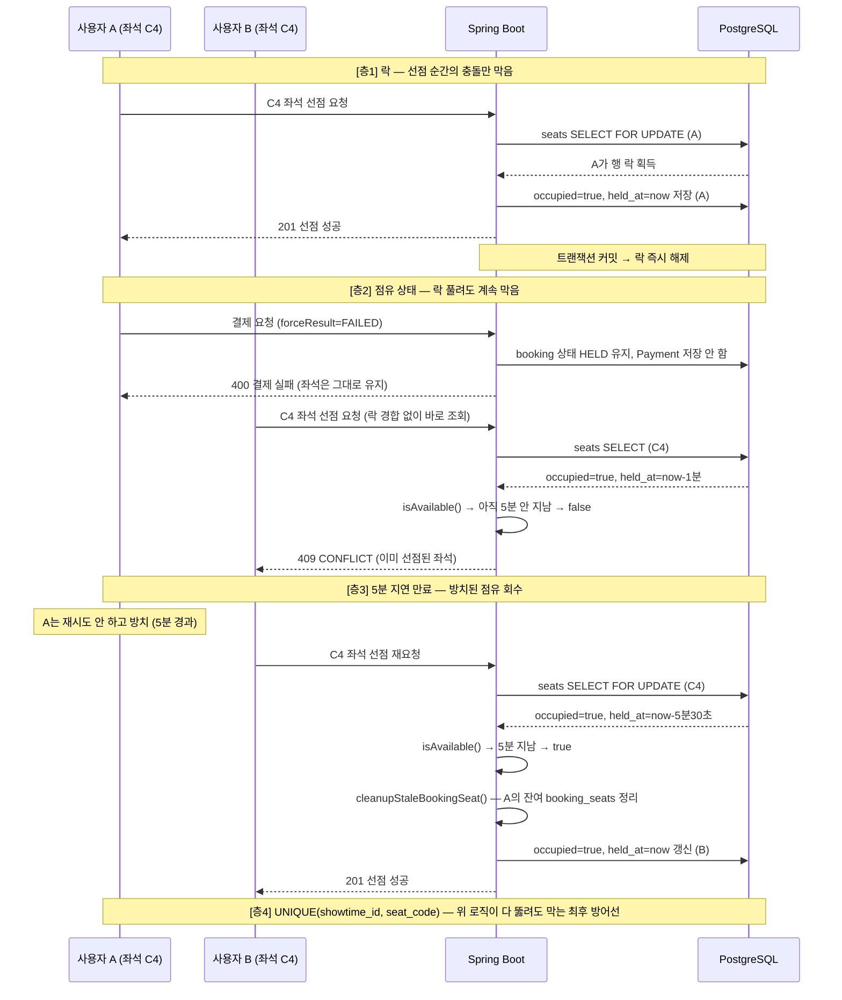
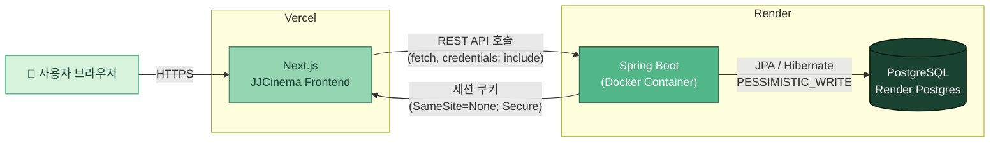

## JJCinemaBackend
> 영화 예매 서비스의 핵심 동선을 직접 설계하고 해결하는 데 초점을 둔 개인 프로젝트 입니다.
> [(접속 URL)](https://jjcinema.vercel.app) - ID:test@test.com / PW:1234

## 프로젝트 목표
- 백엔드 기본기 학습
- Restful API 설계 경험
- 상용 서비스의 도메인 분석 및 구현 경험
- 계층형 아키텍처, 인증/인가, 동시성 제어, 결제 흐름, 예외 처리, Role 구분을 직접 만들면서 체화

## 기술 스택

<table>
<tr>
<td valign="top" width="50%">

**Backend**


 

**Database**


</td>
<td valign="top" width="50%">

**Infra / DevOps**


**Frontend (연동)**


</td>
</tr>
</table>
<br>

## 문서/협업
> GIT/GITHUB/NOTION/POSTMAN
## 주요 기능

**일반 사용자**

- 회원가입(닉네임/이메일/비밀번호 형식 검증, 이메일 실시간 중복확인), 로그인/로그아웃(서버 세션 기반, 새로고침 시 세션 복원)
- 영화 목록 조회(상영중/상영예정 탭, 제목·장르 검색), 상영시간표 조회
- 좌석 선택 및 임시선점(HOLD, 5분), 모의 결제(성공/실패 시뮬레이션), 예매 확정
- 내 예매 조회, 예매 취소(결제완료 건은 환불 처리)

**관리자**

- 대시보드: 오늘/누적 매출·예매 통계, 상영별 좌석 점유율
- 영화 관리: 등록/수정(포스터 업로드, 장르·등급 DB 연동 드롭다운)
- 상영 관리: 다중 슬롯 일괄 등록, 개별 수정, 여러 회차 선택 후 일괄 수정(상영관/가격)
- 회원 관리: 역할(일반/관리자) 변경, 계정 활성/비활성 (본인 계정은 변경 불가)

## 주요 서비스 흐름
- 영화 목록/상세, 상영 회차, 좌석 배치도를 조회하고 좌석을 선택해 예매합니다.
- 좌석은 선택 즉시 확정되는 것이 아니라 **5분간 임시 선점(HOLD)** 되며, 그 안에 결제해야 예매가 확정(CONFIRMED)됩니다.

**좌석 구성**
| 구분 | 내용 |
| --- | --- |
| 배치 | 5행(A-E) × 8열(1-8), 총 40석 |
| 상영관당 좌석 | 상영 회차 등록 시 40석 자동 생성 |
| 임시 선점 시간 | 5분 (초과 시 자동으로 예매 가능 상태로 취급) |

**예매 정책**
- 로그인한 회원만 예매 가능 (세션 기반 인증)
- 한 번에 여러 좌석 동시 선점 가능, 중복 좌석 선택 불가
- 임시 선점(HOLD) 상태에서만 결제 가능, 5분 초과 시 재선택 필요
- 예매 취소 시 좌석은 즉시 반납되어 다른 사용자가 선택 가능



## ERD
**[ERD 링크](https://www.erdcloud.com/d/XnissnvXBK8n68nhE)**


**엔티티 설계 컨벤션**
- 엔티티 생성은 Lombok `@Builder` 대신 **정적 팩토리 메서드**(`static create(...)`)를 사용

**DB 제약조건 / 인덱스**
- `seats`, `booking_seats`: `UNIQUE(showtime_id, seat_code)` — 같은 상영 회차의 같은 좌석이 중복 저장되지 않도록 DB 레벨에서 강제
- `payments.booking_id`: `UNIQUE` — 예매 1건당 결제 1건만 허용
- `showtimes`: `UNIQUE(theater, date, time)` — 같은 상영관·같은 시간대 중복 등록 방지
- 조회 빈도가 높은 컬럼(`showtime_id`, `movie_id`, `user_id`, `status` 등)에 인덱스 적용

## ⚙️ 동시성 설계



**설계 포인트**
- **좌석 단위 락**: 정확히 같은 순간에 같은 좌석을 두 요청이 동시에 때릴 때만 유효합니다. `SELECT FOR UPDATE`로 행 락을 걸어 하나만 통과시키고, 트랜잭션이 커밋되는 즉시 락은 풀립니다. 즉 락은 "그 찰나의 충돌"만 막을 뿐, 그 이후 상태까지 보장해주지 않습니다. **좌석 단위 비관적 락(`PESSIMISTIC_WRITE`)** 으로 처리합니다.
  - **데드락 방지**: 한 번에 여러 좌석을 예매할 때는 좌석 코드를 정렬한 뒤 항상 같은 순서로 락을 겁니다. 예를 들어 사용자 A가 `[C5, C4]`, 사용자 B가 `[C4, C5]` 순서로 동시에 요청해도, 두 트랜잭션 모두 정렬된 순서(C4 → C5)로만 락을 시도하기 때문에 서로 반대 순서로 락을 기다리다 영원히 멈춰버리는 데드락 상황 자체가 발생하지 않습니다.
- **점유 상태(occupied) 체크**: 락이 풀린 뒤에도, 좌석이 HOLD 상태인 동안엔 `held_at` 기준 5분이 지나기 전까지 다른 사용자의 선점 시도를 락 경합 없이도 바로 거절합니다. 결제가 실패해도 좌석은 임의로 풀리지 않고 원래 점유자에게 재시도 기회가 남아있습니다.
- **Lazy Expiration(지연 만료)**: 원래 점유자가 5분 넘게 방치하면, 다음 요청이 들어오는 시점에 `held_at` 경과를 계산해 만료로 판단하고 자동으로 좌석을 회수합니다. 별도 스케줄러 없이도, 방치된 점유가 다른 사용자의 새 요청을 영원히 막지 않도록 설계했습니다.
- **DB UNIQUE 제약**: 위 세 층의 애플리케이션 로직이 버그나 예외 상황으로 전부 무력화되더라도, `UNIQUE(showtime_id, seat_code)` 제약이 DB 레벨에서 중복 저장 자체를 물리적으로 차단하는 최후 방어선입니다.
  
## 배포 아키텍쳐

## API 설계

| 메서드 | 경로 | 설명 | 권한 |
| --- | --- | --- | --- |
| POST | `/api/auth/signup` | 회원가입 | 공개 |
| POST | `/api/auth/login` | 로그인 | 공개 |
| GET | `/api/auth/me` | 로그인 상태 확인 | 로그인 필요 |
| POST | `/api/auth/logout` | 로그아웃 | 로그인 필요 |
| GET | `/api/auth/check-email` | 이메일 중복확인 | 공개 |
| GET | `/api/movies`, `/api/movies/{id}` | 영화 조회 | 공개 |
| GET | `/api/showtimes`, `/api/showtimes/{id}` | 상영 조회 | 공개 |
| GET | `/api/showtimes/{id}/seats` | 좌석 배치도 조회 | 공개 |
| POST | `/api/bookings` | 좌석 선점(예매 생성) | 로그인 필요 |
| GET | `/api/bookings/me`, `/api/bookings/{id}` | 내 예매 조회 | 로그인 필요(본인만) |
| DELETE | `/api/bookings/{id}` | 예매 취소 | 로그인 필요(본인만) |
| POST | `/api/payments` | 모의 결제 | 로그인 필요 |
| GET/POST/PATCH/DELETE | `/api/admin/**` | 영화·상영·회원 관리, 통계 | `ROLE_ADMIN` |
- 관리자 전용 API는 컨트롤러를 `admin` 패키지·`/api/admin/**` 경로로 분리하고, `SecurityConfig`에서 `.requestMatchers("/api/admin/**").hasRole("ADMIN")` 로 권한을 관리합니다.

**응답 형식**

모든 API는 아래 공통 포맷으로 응답합니다.

```json
{
  "success": true,
  "message": "설명 메시지",
  "data": {}
}
```

**오류 코드**

| HTTP 상태 | 사용 시점 |
| --- | --- |
| 400 Bad Request | 입력값 검증 실패 (IllegalArgumentException) — 중복 좌석, 존재하지 않는 좌석 등 |
| 401 Unauthorized | 로그인하지 않은 상태로 인증 필요한 API 접근 |
| 403 Forbidden | 본인 소유가 아닌 리소스 접근, 또는 관리자 권한 필요 |
| 404 Not Found | 리소스를 찾을 수 없음 (IllegalStateException) — 존재하지 않는 예매/영화/회차 등 |
| 409 Conflict | 좌석 중복 선점, DB 제약 위반 (DataIntegrityViolationException) |
| 500 Internal Server Error | 그 외 예상하지 못한 서버 오류 |


**프로젝트 구조**
- 프로젝트의 규모를 고려하여 `계층형(layered Architecture)` 구조를 사용 하였습니다.
```
src/main/java/com/jjcompany/jjcinemabackend/
├── JJCinemaBackendApplication.java
├── admin/             # 관리자 컨트롤러
├── config/            # SecurityConfig, PasswordConfig 등 설정 클래스
├── controller/        # REST 컨트롤러
├── domain/            # JPA 엔티티 (Genre, Rating, Booking, Movie, Payment, Showtime, User 등)
├── dto/
│   ├── request/       # 요청 DTO
│   └── response/      # 응답 DTO
├── repository/        # Spring Data JPA 리포지토리
├── security/          # CustomUserDetailsService 등 인증 관련
└── service/           # 비즈니스 로직
```

---

## 예외 처리
- GlobalExceptionHandler 를 적용하여, 각 컨트롤러마다 try-catch 넣을 필요 없이 자동으로 이 핸들러가 예외를 낚아 채서 예외 코드 + ApiResponse.fail(메시지) 형식으로 변환 합니다. (`@RestControllerAdvice`로 전역 예외 처리 통일)

```java
@RestControllerAdvice
public class GlobalExceptionHandler {
    @ExceptionHandler(IllegalStateException.class)
    public ResponseEntity<ApiResponse<Void>> handleNotFound(IllegalStateException e){
        return ResponseEntity
                .status(HttpStatus.NOT_FOUND)
                .body(ApiResponse.fail(e.getMessage()));
    }
...
```

## 보안 파일 관리 규칙
- `.env`와 같은 개인 API 키는 **절대 커밋 금지**
- `.gitignore`에 반드시 추가

## 로컬 환경 실행
1. Git Clone 하기
2. `sql/schema.sql`을 원하는 PostgreSQL DB에 직접 실행해서 테이블을 생성
3. 백엔드 서버 및 프론트 실행
- 기본 포트는 `8080`입니다.

## 시연

